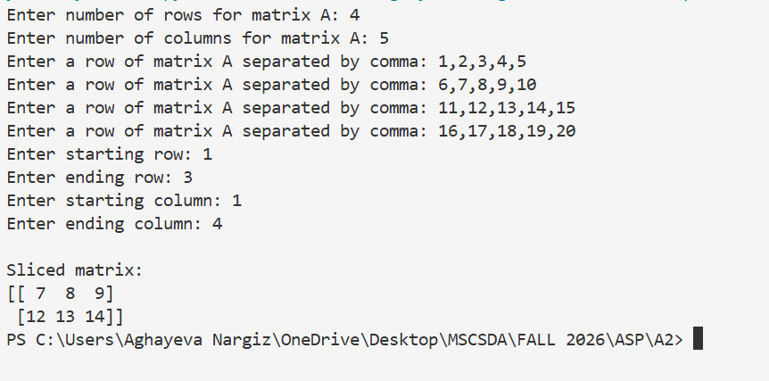
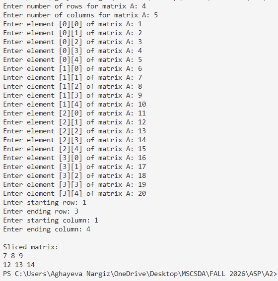

# Task 4: 2D Matrix Slicing

## Objective

The objective of this task is to implement 2D matrix slicing using NumPy in Python and a C++ implementation. The results of both implementations are compared to check whether they produce the same sliced matrix.

## Python/NumPy Implementation

The Python implementation uses a NumPy array to store the user-defined matrix. The user also provides the starting and ending row and column indices for the slice.

NumPy provides built-in 2D slicing using the following syntax:

```python
matrix_A[start_row:end_row, start_column:end_column]
```

The ending indices are not included in the slice.

## C++ Implementation

The C++ implementation uses a `vector<vector<int>>` to represent the matrix because the number of rows and columns is defined by the user at runtime.

C++ does not provide NumPy-style 2D matrix slicing, so nested `for` loops are used to access the elements between the specified starting and ending row and column indices.

## Results

Both implementations were tested using the same matrix and the same slicing parameters. The selected slice was:

* Starting row: 1
* Ending row: 3
* Starting column: 1
* Ending column: 4

The resulting matrix was:

```text
7  8  9
12 13 14
```

The screenshots below show the outputs produced by each implementation.

### Python/NumPy Output



### C++ Output



Both implementations produced the same sliced matrix, which confirms that the C++ implementation gives the same result as the NumPy implementation for this test case.

## Conclusion

The task demonstrated that the same 2D matrix slicing operation can be implemented in both Python with NumPy and C++. NumPy provides a direct slicing operation, while the C++ implementation requires nested loops to select the required rows and columns. The outputs of both implementations were identical for the tested case.
